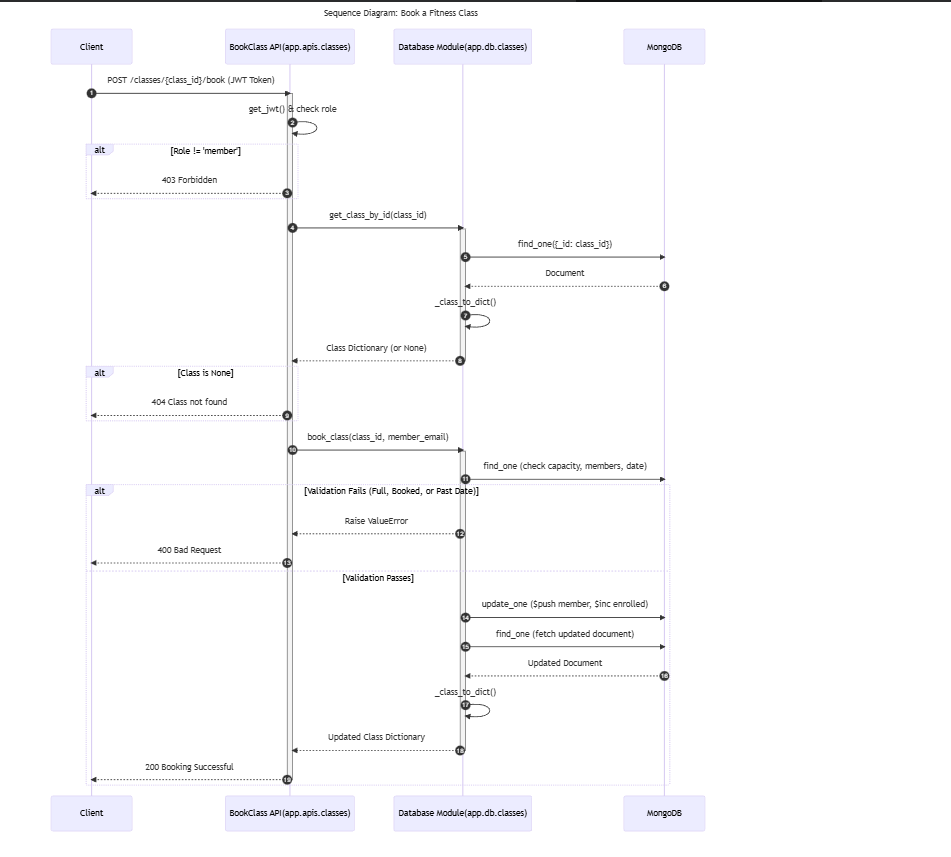
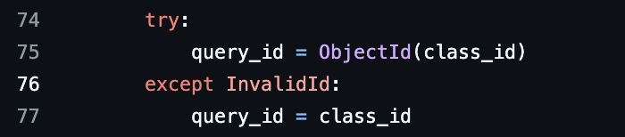
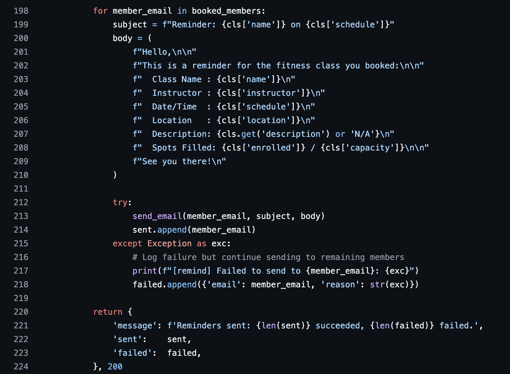
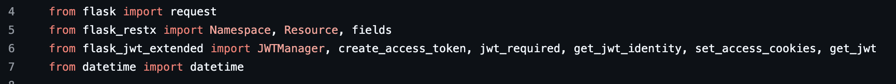
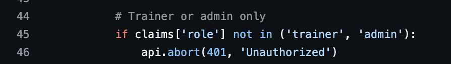
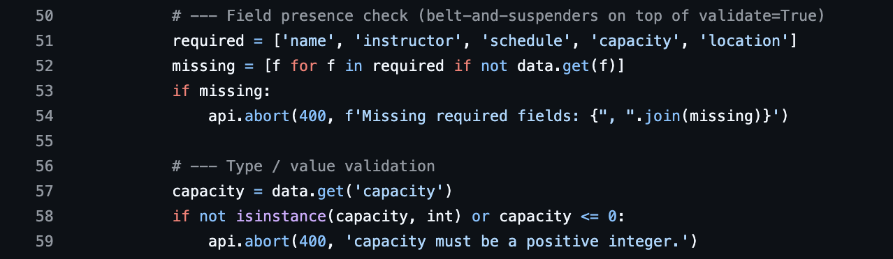

## Executive Summary

For this deliverable, our team combined reverse engineering tools with manual analysis to understand and document the current system design.

For Task 1 (Design Diagrams):
- Umair used **Mermaid code** to generate the class diagram representing the main classes and their associations.
- Shahzaib used the **Visual Studio PyReverseSequence Plugin** to generate the sequence diagram for the *Book a Class* endpoint.
- Sadaf used the **Visual Studio PyReverseSequence Plugin** to generate the sequence diagram for the *Send Reminders* endpoint.

All diagrams were manually reviewed and refined by the team to ensure accuracy, readability, and alignment with the actual system behavior.

For Tasks 2 and 3 (Design Principles & Code Smells):
All team members individually analyzed the codebase. We created a shared document where each member identified violations and code smells. These were then discussed as a group, and the most relevant and representative examples were selected.

For Task 4 (Reflection on New Features):
The team collectively discussed how the current system design would impact the implementation of the new features, particularly in terms of maintainability and extensibility. Based on this discussion, Mohammad Shahzaib compiled and wrote the final reflection.

All final materials, including executive summary, diagrams and analysis, were compiled, and uploaded to GitHub by Sadaf.

## TASK 1

**Class Diagram - Umair Hafeez**

**Sequence Diagram for booking endpoint - Muhammad Shahzaib Hassan**

**Sequence Diagram for email reminder endpoint - Sadaf Habib**

## TASK2 

1. Single Responsibility Principle (SRP) File: app/apis/classes.py | Method: SendReminders.post() - line 153 - 224

The SendReminders.post() method is responsible for HTTP routing, authorization, fetching database records, constructing the email body template, executing the send loop, handling exceptions, and aggregating the result payload — all in one place. SRP states that a module or class should have only one reason to change. This method has at least four. If the marketing team wants to change the wording of the email, a developer must modify the API routing file — which has nothing to do with marketing content.

The Fix: Abstract the email body construction into a dedicated templating helper or service function, and extract the send loop into EmailService.

2. Encapsulation / Information Hiding File: app/apis/classes.py | Method: ClassList.get() - line 84 - 89

Encapsulation dictates that a module should manage its own internal state and hide its details from other layers. Here, get_all_classes() leaks the internal booked_members field, forcing the API layer to manually strip it using pop(). The API layer should not need to know the internal structure of the database document.

The Fix: Pass a flag like get_all_classes(include_members=False) to the DB layer, or use a serialization layer like Marshmallow to define what fields are exposed publicly.

3. Open/Closed Principle (OCP) File: app/apis/auth.py - line 73 and app/apis/classes.py - line 45 & 106 

OCP states that software entities should be open for extension but closed for modification. Adding a new role like 'Coach' requires opening and modifying auth.py to add it to the validation list, then opening and modifying every handler in classes.py that needs to allow or restrict that role. Role definitions are scattered as hardcoded strings across multiple files, meaning the system cannot accommodate new roles without touching already-working, already-tested code.

The Fix: Centralize roles into a Python Enum or constants file, and abstract role validation into a reusable decorator such as @require_roles('trainer', 'admin').

4. Dependency Inversion Principle (DIP) File: app/db/classes.py | All database operation functions - e.g line 65 - 72

DIP states that high-level modules should not depend on low-level modules — both should depend on abstractions. Every function in db/classes.py is tightly coupled to the concrete global DB object. This creates a rigid dependency hierarchy and makes unit testing difficult, as you cannot easily swap DB for a mock or in-memory database without monkey-patching.

The Fix: Use the Repository Pattern, or refactor the functions into a class where the database connection is injected via the constructor (Dependency Injection).

5. Low Coupling File: app/apis/classes.py | Method: SendReminders.post() - line 153 - 224 | Also: app/apis/auth.py | Method: Register.post() - line 40 - 89

Both route handlers reach directly into the database layer with no service layer in between. SendReminders.post() calls cls_db.get_class_by_id() and cls_db.get_booked_members() directly, and Register.post() calls users_db.get_user_by_email() and users_db.add_user() directly. Low coupling means changes to one module should not force changes in another. If any database function changes its signature or return value, the route handler breaks immediately.

The Fix: Introduce a service layer between the API and DB layers to absorb changes and decouple the two.

## TASK3

1. Duplicated Code File: app/db/classes.py | Methods: get_class_by_id() - line 74-77, book_class() - 110-113, get_booked_members() - line 161-164

This identical try/except block for parsing MongoDB ObjectIDs is repeated across three separate methods. If the ID handling logic ever needs to change — for example due to a database migration or ID format change — it must be found and updated in every method individually, risking inconsistency.

The Fix: Extract into a single private helper function _parse_id(class_id: str) and call it from each method.

2. Long Method File: app/apis/classes.py | Method: SendReminders.post() - line 153-224

This single method spans roughly 45 lines and handles HTTP authorization, database fetching, past-class validation, email subject and body construction, a send loop with per-recipient error handling, and result aggregation. A method should do one thing and be readable at a glance.

The Fix: Extract the email templating and send loop into a dedicated service function such as EmailService.send_class_reminders(cls_data, members).

3. Dead Code (Unused Imports) File: app/apis/classes.py - line 6

JWTManager, create_access_token, get_jwt_identity, and set_access_cookies are imported but never used anywhere in classes.py. The only ones actually used are jwt_required and get_jwt. The same issue exists in auth.py. Dead imports add noise, increase cognitive load, and can mislead developers into thinking these are dependencies of the module.

The Fix: Remove all unused imports. The corrected import should be:

    from flask_jwt_extended import jwt_required, get_jwt

4. Magic Strings File: app/apis/classes.py | Methods: ClassList.post() - line 45, ClassMembers.get() - line 139, SendReminders.post() - line 169

The role strings 'trainer', 'admin', and 'member' appear as raw string literals directly in multiple if statements across the codebase with no central definition. This is prone to silent bugs — a typo like 'trinaer' will not raise an error but will silently break authorization logic. It also makes refactoring difficult as there is no single source of truth.

The Fix: Define roles as a Python Enum or class constants, for example Roles.TRAINER, and reference those constants throughout the codebase.

5. Comments Smell File: app/apis/classes.py | Method: ClassList.post() - line 50 & 56

These section-marker comments exist only because the method is too long to understand without signposts. According to clean code principles, a comment that explains what a block of code does is a signal that the block should be extracted into a well-named function. The comment is compensating for poor structure rather than adding genuine information.

The Fix: Extract each section into its own well-named private method such as _validate_required_fields(data) and _validate_capacity(data), making the comments unnecessary.

## TASK4

Given the new features slated for the next sprint, our current design will significantly hinder their implementation from a maintainability and extensibility standpoint. The codebase currently suffers from tight coupling, missing abstractions, and several violations of the Open/Closed Principle (OCP) and Single Responsibility Principle (SRP), all of which will make adding these new features difficult and prone to bugs.

**Feature 6: Create Recurring Class**
* **The Problem:** The current `ClassList.post()` method directly handles HTTP request parsing, input validation, and database interactions in a single block. Implementing a feature that allows trainers to create recurring classes (e.g., daily or monthly) would require complex logic to calculate future dates and execute multiple database insertions.
* **Impact of Design Flaws:** Because we currently lack a dedicated Service Layer (a Low Coupling violation identified in Task 2), adding this logic directly into the API route will exacerbate the existing "Long Method" and SRP violations. It will result in a bloated endpoint that is difficult to read and hard to unit test.
* **Path Forward:** To implement this extensibly, we must extract the class creation logic out of `app/apis/classes.py` and into a dedicated `ClassService`. This service can handle the business logic of generating recurring schedules before interacting with the database repository.

**Feature 7: Configure Notifications**
* **The Problem:** The current system hardcodes the concept of "notifications" entirely to "emails." The `SendReminders.post()` method manually constructs the email body and loops through recipients, while `app/services/email_service.py` is tightly bound to AWS SES. Users now need the ability to choose how they receive reminders, such as via Telegram, SMS, or email.
* **Impact of Design Flaws:** Our current architecture severely violates the Open/Closed Principle (OCP). To support SMS or Telegram, we would be forced to open `SendReminders.post()`, add conditional logic checking user preferences, and import new services directly into the API layer. This also violates the Dependency Inversion Principle (DIP), as the high-level API depends directly on the low-level email service rather than an abstraction.
* **Path Forward:** We need to introduce a generalized Notification abstraction (e.g., applying the Strategy Pattern). The API should simply call a method like `NotificationService.send_reminders(class_id)`, which then delegates the actual sending to concrete implementations (`EmailNotifier`, `SMSNotifier`, `TelegramNotifier`) based on the user's fetched preferences. Furthermore, the message construction should be abstracted into a templating helper (fixing the SRP violation identified in Task 2) so that different notification channels can format their own specific message lengths and payloads.

**Conclusion**
Ultimately, the current architecture is not extensible enough to support these new features gracefully. We must prioritize refactoring the API to decouple it from the database and extract business logic into service layers before attempting to build out the new requirements.
