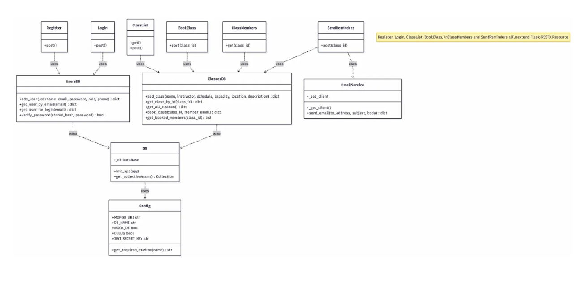
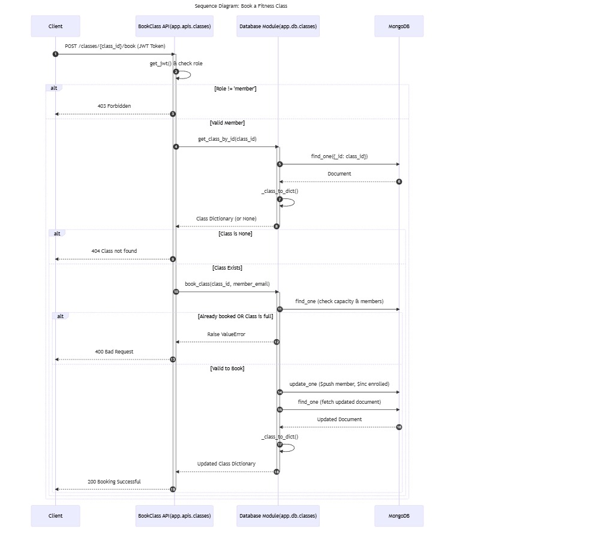
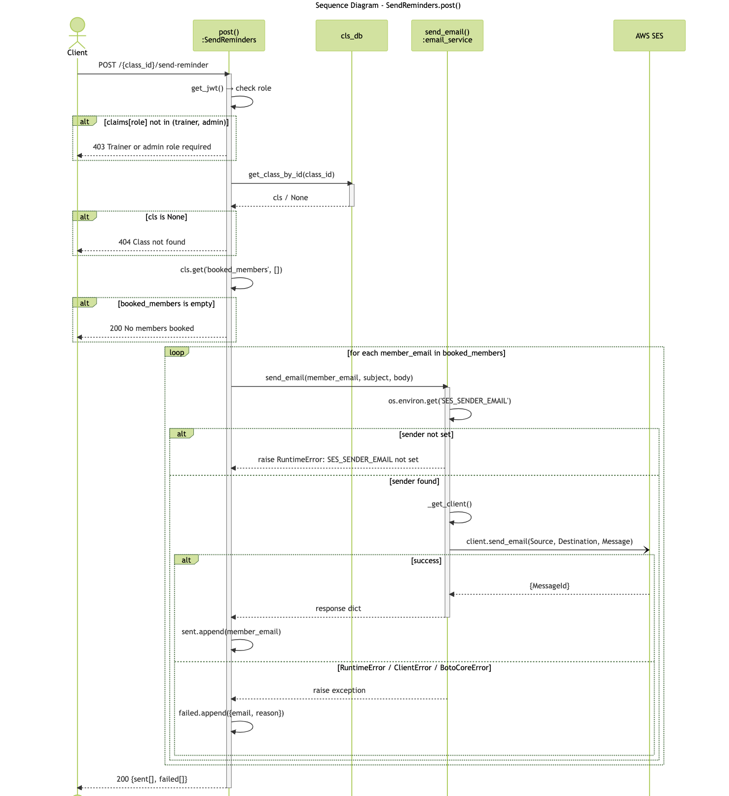
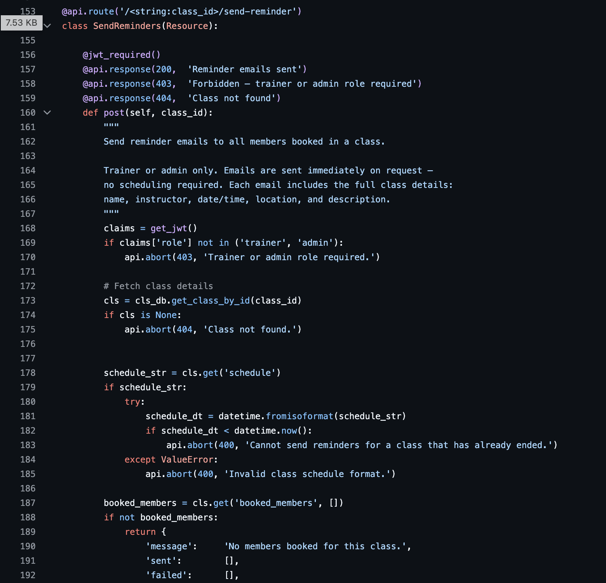
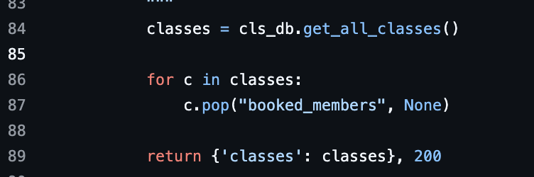
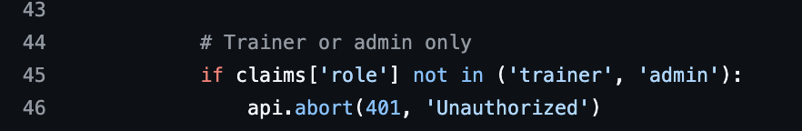
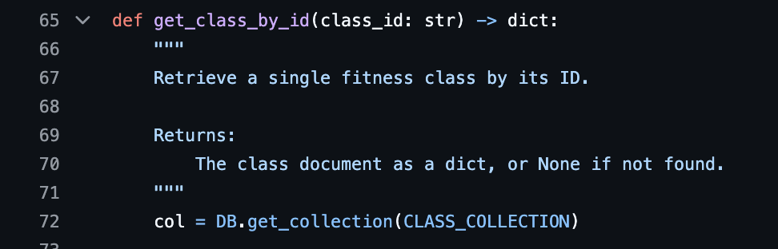
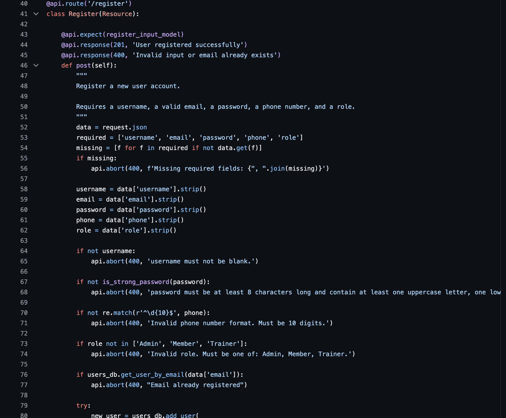

## Executive Summary

For this deliverable, our team combined reverse engineering tools with manual analysis to understand and document the current system design.

For Task 1 (Design Diagrams):
- Umair used **Mermaid code** to generate the class diagram representing the main classes and their associations.
- Shahzaib used the **Visual Studio PyReverseSequence Plugin** to generate the sequence diagram for the *Book a Class* endpoint.
- Sadaf used the **Visual Studio PyReverseSequence Plugin** to generate the sequence diagram for the *Send Reminders* endpoint.

All diagrams were manually reviewed and refined by the team to ensure accuracy, readability, and alignment with the actual system behavior.

For Tasks 2 and 3 (Design Principles & Code Smells):
All team members individually analyzed the codebase. We created a shared document where each member contributed identified violations and code smells. These were then discussed as a group, and the most relevant and representative examples were selected. Based on this discussion, Mohammad Umair compiled and wrote the final reflection.

For Task 4 (Reflection on New Features):
The team collectively discussed how the current system design would impact the implementation of the new features, particularly in terms of maintainability and extensibility. Based on this discussion, Mohammad Shahzaib compiled and wrote the final reflection.

All final materials, including executive summary, diagrams and analysis, were compiled, and uploaded to GitHub by Sadaf.

## TASK 1

**Class Diagram - Umair Hafeez**

**Sequence Diagram for booking endpoint - Muhammad Shahzaib Hassan**

**Sequence Diagram for email reminder endpoint - Sadaf Habib**

## TASK2 

1. Single Responsibility Principle (SRP) File: app/apis/classes.py | Method: SendReminders.post() - line 153 - 224

The SendReminders.post() method is responsible for HTTP routing, authorization, fetching database records, constructing the email body template, executing the send loop, handling exceptions, and aggregating the result payload — all in one place. SRP states that a module or class should have only one reason to change. This method has at least four. If the marketing team wants to change the wording of the email, a developer must modify the API routing file — which has nothing to do with marketing content.

The Fix: Abstract the email body construction into a dedicated templating helper or service function, and extract the send loop into EmailService.

2. Encapsulation / Information Hiding File: app/apis/classes.py | Method: ClassList.get() - line 84 - 89

Encapsulation dictates that a module should manage its own internal state and hide its details from other layers. Here, get_all_classes() leaks the internal booked_members field, forcing the API layer to manually strip it using pop(). The API layer should not need to know the internal structure of the database document.

The Fix: Pass a flag like get_all_classes(include_members=False) to the DB layer, or use a serialization layer like Marshmallow to define what fields are exposed publicly.

3. Open/Closed Principle (OCP) File: app/apis/auth.py - line 73 and app/apis/classes.py - line 45 & 106 

OCP states that software entities should be open for extension but closed for modification. Adding a new role like 'Coach' requires opening and modifying auth.py to add it to the validation list, then opening and modifying every handler in classes.py that needs to allow or restrict that role. Role definitions are scattered as hardcoded strings across multiple files, meaning the system cannot accommodate new roles without touching already-working, already-tested code.

The Fix: Centralize roles into a Python Enum or constants file, and abstract role validation into a reusable decorator such as @require_roles('trainer', 'admin').

4. Dependency Inversion Principle (DIP) File: app/db/classes.py | All database operation functions - e.g line 65 - 72

DIP states that high-level modules should not depend on low-level modules — both should depend on abstractions. Every function in db/classes.py is tightly coupled to the concrete global DB object. This creates a rigid dependency hierarchy and makes unit testing difficult, as you cannot easily swap DB for a mock or in-memory database without monkey-patching.

The Fix: Use the Repository Pattern, or refactor the functions into a class where the database connection is injected via the constructor (Dependency Injection).

5. Low Coupling File: app/apis/classes.py | Method: SendReminders.post() - line 153 - 224 | Also: app/apis/auth.py | Method: Register.post() - line 40 - 89

Both route handlers reach directly into the database layer with no service layer in between. SendReminders.post() calls cls_db.get_class_by_id() and cls_db.get_booked_members() directly, and Register.post() calls users_db.get_user_by_email() and users_db.add_user() directly. Low coupling means changes to one module should not force changes in another. If any database function changes its signature or return value, the route handler breaks immediately.

The Fix: Introduce a service layer between the API and DB layers to absorb changes and decouple the two.

## TASK3

## TASK4
