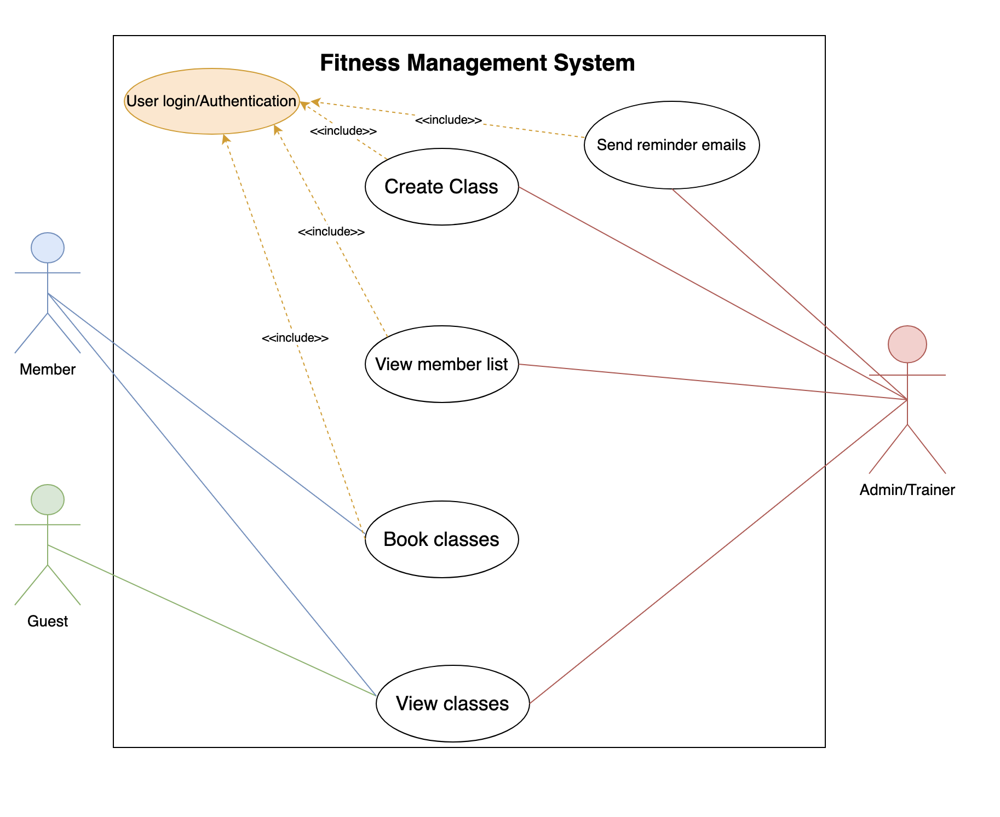

# Requirements Document for Fitness Class Management System

## 1. Requirements Elicitation and Analysis

**Meeting Date:** February 10, 2026

**Elicitation Techniques Used:**
* **Structured Interview / Q&A:** We conducted a direct question-and-answer session with the client to define the scope of Sprint 1. We specifically asked about user roles, authentication requirements, class constraints, and features such as filtering and sorting of classes. This helped clarify what was expected for the current sprint.
* **Constraint Analysis:** We walked through potential features like password recovery, payments, and notifications to determine what was necessary for the current sprint and what should be deferred to future work.
* **Use Cases & UML Diagramming (Post-Meeting):** After the meeting, we created a UML use case diagram and fleshed out detailed use cases for each feature. This visual and written representation helped us better understand each feature and the interactions between users and the system.

**Reflections:**
1. **Utility of Techniques:** The structured interview was highly effective for establishing strict boundaries for the project. By asking specific questions about features like password verification and payment systems, we were able to eliminate unnecessary work and focus purely on the core booking and class management logic.
2. **Important Clarification Gained:** A critical clarification gained was regarding class scheduling and capacity. We learned that while class times are permitted to overlap, the trainer must have the authority to set a specific capacity limit for each session.

## 2. Requirements Specification

### 2.1 Use Case Diagram

